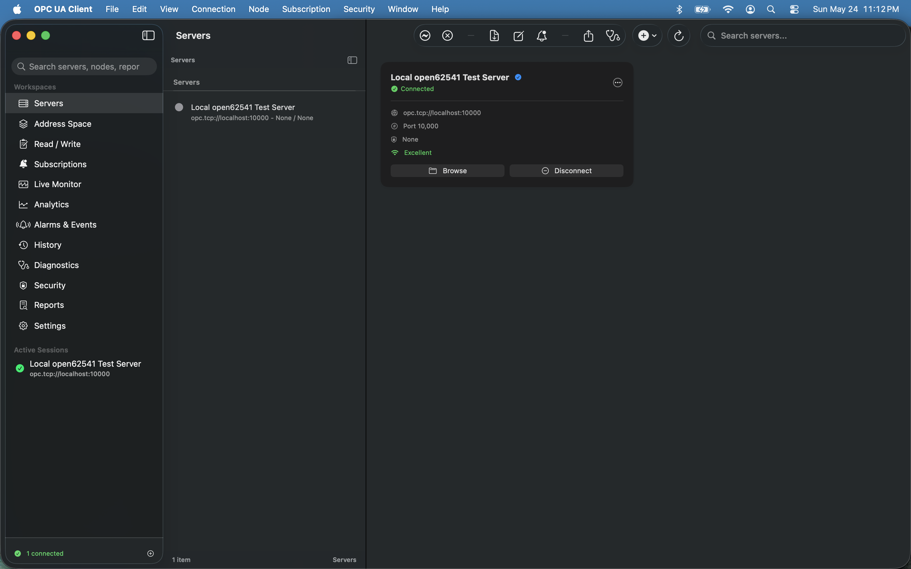
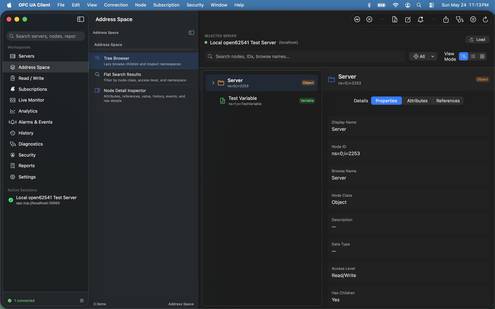
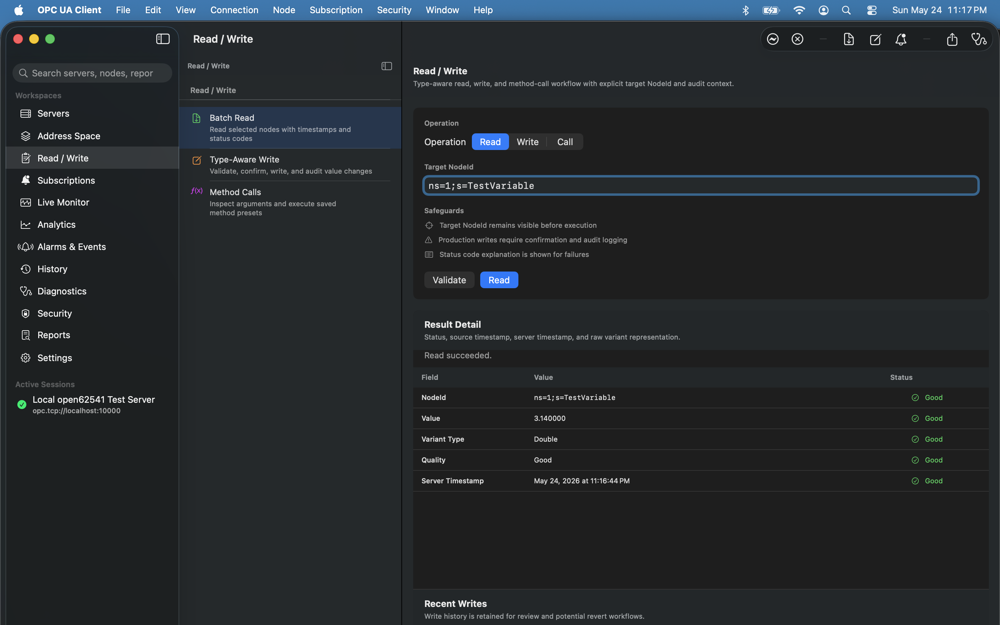
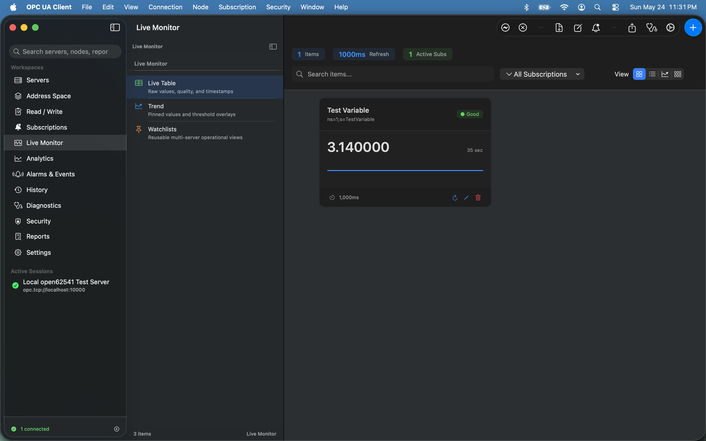
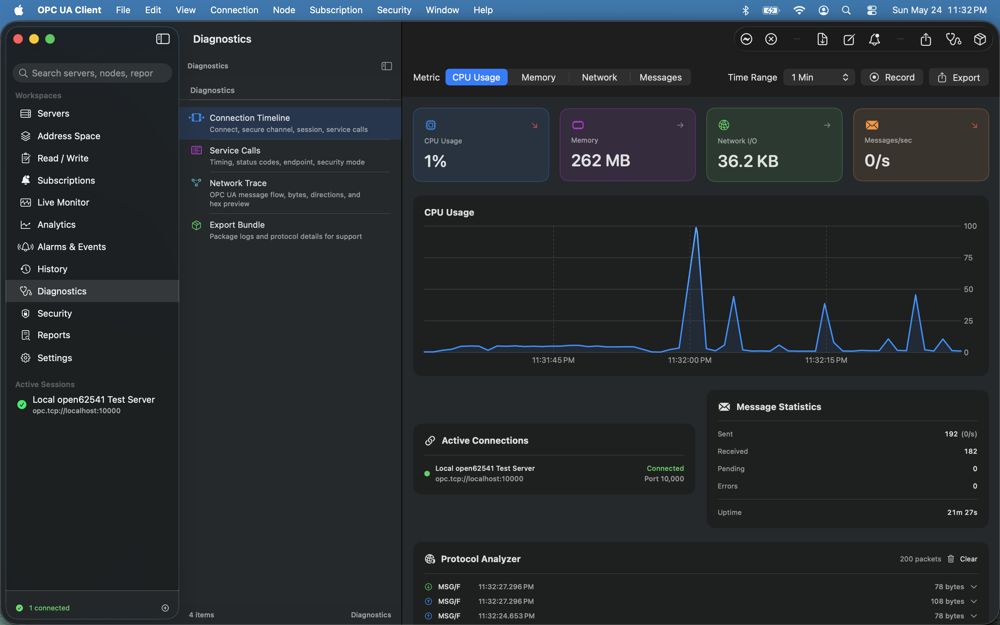
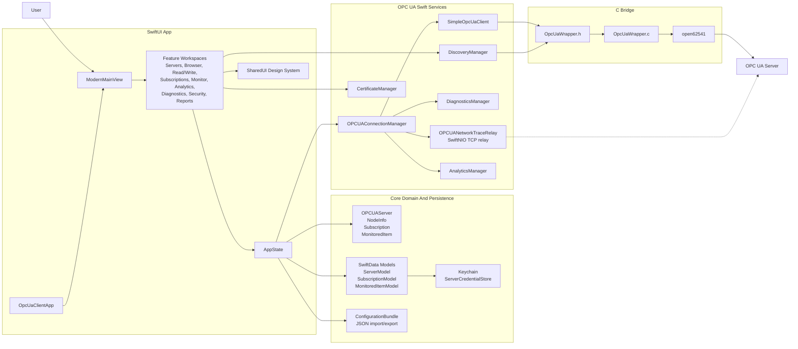

# OPC UA Client

OPC UA Client is a SwiftUI macOS app for configuring OPC UA server
connections, browsing address spaces, reading and writing node values, managing
subscriptions, monitoring live data, and inspecting diagnostics. The Swift app
uses a small C bridge over `open62541` for OPC UA wire operations.

## Current Support

- Platform: macOS only
- Verified build environment: macOS SDK 26.5, Xcode 26.5
- Minimum supported system: macOS 14.0 or later on Apple Silicon
- Architecture verified in this repository: `arm64`
- OPC UA dependency: `open62541` from Homebrew
- Transport supported by this build: `opc.tcp`

The project intentionally targets macOS only. iOS, visionOS, and simulator
platforms are not configured in this build. macOS 14.0 is the practical floor
because the app uses SwiftData.

## Feature Overview

Client operations backed by the Swift/C `open62541` bridge:

- Server connection profiles for `opc.tcp://host:port` endpoints.
- Anonymous, username/password, and certificate-oriented authentication modes.
- Security mode and policy selection, including `None`, `Sign`, and
  `Sign & Encrypt` with policies such as `Basic256Sha256`,
  `Aes128_Sha256_RsaOaep`, and `Aes256_Sha256_RsaPss`.
- Endpoint discovery through OPC UA `GetEndpoints`.
- Address space browsing from the Objects folder and child node browsing by
  NodeId.
- Scalar reads as strings, plus data type reads for UI-assisted writes.
- Scalar writes for Boolean, signed/unsigned integers, Float, Double, and
  String values.
- OPC UA subscriptions with monitored items, sampling intervals, latest-value
  callbacks, and automatic restoration after reconnect.
- Local connection health checks and automatic reconnect with exponential
  backoff.

Application workspaces and supporting features:

- **Servers**: create, edit, duplicate, set default, import/export, discover,
  connect, disconnect, and test connection profiles.
- **Address Space**: tree, flat, and grid browsing with node filtering, search,
  detail panels, read-on-demand, and node pickers for monitoring/analytics.
- **Read / Write**: type-aware read/write workflow with status rows and local
  write history. Method-call UI is present, but method calls are not wired to an
  OPC UA service yet.
- **Subscriptions**: persisted subscription configuration, monitored item
  management, validation against the current server address space, deadband
  settings, queue settings, and live value refresh.
- **Live Monitor**: grid, list, compact, and chart views over active monitored
  items, including quality badges and short in-memory sparkline history.
- **Analytics**: numeric tracked items, live trend/comparison charts, local
  statistics, and CSV/JSON export for collected analytics samples.
- **Alarms & Events**: in-app alarm/event logging for connection,
  subscription, and data-change activity.
- **Diagnostics**: process CPU/memory metrics, message counters, logs,
  protocol packet records, network trace relay capture, and diagnostics bundle
  export.
- **Security**: security posture review for configured profiles, certificate
  inventory surfaces, trusted/rejected certificate sections, and audit-log
  visibility through diagnostics.
- **Reports**: generated Markdown snapshots for server profiles, security
  posture, namespace inventory, subscriptions, history, events, and diagnostics.
- **Persistence**: SwiftData-backed servers, subscriptions, monitored items,
  historical value snapshots, schema cleanup/migration fallback, and Keychain
  storage for server passwords.

Scope notes:

- `opc.tcp` is the supported transport in this build; `opc.wss` is modeled but
  not enabled.
- The History workspace currently generates local preview/export rows; the C
  bridge does not expose OPC UA `HistoryRead` yet.
- Configuration export intentionally omits passwords. Imported legacy passwords
  are migrated into Keychain when saved.

## Screenshots

Click any screenshot to open it at full size.

| Server Profiles | Address Space Browser |
| --- | --- |
| [](AppStore/screenshots/macOS/01-server-profiles.png) | [](AppStore/screenshots/macOS/02-address-space-browser.png) |
| Read / Write | Live Monitoring |
| [](AppStore/screenshots/macOS/03-read-write.png) | [](AppStore/screenshots/macOS/04-monitoring.png) |
| Diagnostics & Security | |
| [](AppStore/screenshots/macOS/05-diagnostics-security.png) | |

## Architecture



At runtime, `OpcUaClientApp` builds a SwiftData `ModelContainer`, creates
`AppState`, and presents `ModernMainView`. Feature workspaces call into
`AppState` and `OPCUAConnectionManager`; the connection manager owns live
`SimpleOpcUaClient` instances keyed by server ID. `SimpleOpcUaClient` is the
thread-safe Swift wrapper around the C ABI in `OPCUA/CBridge`, which delegates
OPC UA protocol work to the Homebrew-provided `open62541` library.

## Prerequisites

Install Xcode and Homebrew, then install `open62541`:

```sh
brew install open62541
```

The default configuration expects Apple Silicon Homebrew at:

```text
/opt/homebrew/opt/open62541
```

Intel Homebrew users can pass:

```sh
OPEN62541_PREFIX=/usr/local/opt/open62541
```

## Build

From the repository root:

```sh
xcodebuild -project OpcUaClient.xcodeproj \
  -scheme OpcUaClient \
  -configuration Debug \
  -destination 'platform=macOS,arch=arm64' \
  CODE_SIGNING_ALLOWED=NO \
  ONLY_ACTIVE_ARCH=YES \
  ARCHS=arm64 \
  build
```

For UI development, open the project in Xcode:

```sh
open OpcUaClient.xcodeproj
```

The shipped app name is `OPC UA Client` and the bundle identifier is
`twinedgeai.com.MacOpcUaClient`.

## Dependency Configuration

`build_config.xcconfig` defines the `open62541` include path, library path, and
runtime search path. The project links to the Homebrew-provided dynamic library
with `-lopen62541` and does not vendor or modify `open62541` sources:

```text
OPEN62541_PREFIX = /opt/homebrew/opt/open62541
```

To build with a different installation:

```sh
xcodebuild -project OpcUaClient.xcodeproj \
  -scheme OpcUaClient \
  -configuration Debug \
  -destination 'platform=macOS,arch=arm64' \
  OPEN62541_PREFIX=/path/to/open62541 \
  CODE_SIGNING_ALLOWED=NO \
  ONLY_ACTIVE_ARCH=YES \
  ARCHS=arm64 \
  build
```

`Package.resolved` under the Xcode workspace is intentionally kept in source
control so Swift Package dependencies resolve reproducibly.

## Distribution Notes

Source releases should include `LICENSE`, `NOTICE`, `THIRD_PARTY_NOTICES.md`,
`TRADEMARKS.md`, and `BINARY_DISTRIBUTION.md`.

Binary `.app` releases need one of these runtime dependency strategies:

- Require users to install `open62541` through Homebrew before launching the app.
- Bundle `libopen62541.dylib` inside the app and include the MPL-2.0 notice,
  license text, and a source-code link for the exact open62541 build used.

If this project ever distributes a modified copy of `open62541`, the modified
`open62541` source files must remain available under MPL-2.0. The application
source remains MIT licensed unless explicitly changed.

See `BINARY_DISTRIBUTION.md` for signing, notarization, and architecture notes.
Generated release artifacts belong in `dist/` and are intentionally not tracked.

Build a macOS 14-compatible release copy of `open62541` when the local Homebrew
bottle targets a newer macOS than the app:

```sh
Tools/build_open62541_release.sh
```

Create a local unsigned package with:

```sh
Tools/package_macos_release.sh
```

Create a public package only with a Developer ID Application certificate and a
stored notarytool profile:

```sh
PUBLIC_RELEASE=1 \
SIGN_IDENTITY="Developer ID Application: Your Name (TEAMID)" \
NOTARY_KEYCHAIN_PROFILE="OPCUAClient" \
Tools/package_macos_release.sh
```

## Local Test Server

Build the sample OPC UA server:

```sh
clang Tools/TestServers/simple_server.c \
  -I"$(brew --prefix open62541)/include" \
  -L"$(brew --prefix open62541)/lib" \
  -lopen62541 \
  -o Tools/TestServers/simple_server
```

Run it:

```sh
Tools/TestServers/simple_server
```

The sample server listens on:

```text
opc.tcp://localhost:10000
```

## Supporting Older Apple Silicon macOS Versions

Apple Silicon Macs can run macOS versions older than 14.0, but this app uses
SwiftData and currently sets `MACOSX_DEPLOYMENT_TARGET = 14.0`. Supporting
macOS 11-13 would require replacing SwiftData persistence or adding a separate
fallback storage path, then retesting persistence, file import/export, charts,
subscriptions, and certificate handling on each older system.

## Credentials And Exports

Server passwords are stored in Keychain. Configuration exports omit passwords.
Imported legacy configurations that contain passwords are accepted, then saved
to Keychain when the server profile is saved.

## Repository Layout

- `App/`
  - `OpcUaClientApp.swift`: SwiftUI app entry point, SwiftData container setup,
    migration fallback, settings scene, and command registration.
  - `AppState.swift`: shared observable state for servers, subscriptions,
    selected workspace, connection progress, persistence loading, and
    configuration import/export.
  - `AppCommands.swift`: macOS command menu integration.
- `Core/`
  - `Models/`: domain models such as `OPCUAServer`, `NodeInfo`,
    `Subscription`, `MonitoredItem`, connection status, security settings, and
    connection test reports.
  - `Persistence/`: SwiftData models and managers for servers, subscriptions,
    monitored items, schema reset helpers, and `ServerCredentialStore` Keychain
    access.
  - `Configuration/`: JSON configuration bundle encoding/decoding and
    file-document wrappers for import/export.
  - `Diagnostics/`: diagnostics bundle export helpers.
  - `Utilities/`: small SwiftUI and color utilities.
- `OPCUA/`
  - `CBridge/`: `OpcUaWrapper.h` and `OpcUaWrapper.c`, the C ABI that adapts
    `open62541` to Swift for connect, discovery, browse, read, write, security,
    and subscriptions.
  - `Client/`: `SimpleOpcUaClient`, the Swift owner of the C client pointer,
    thread lock, subscription loop, value conversion, and write dispatch.
  - `Services/`: connection orchestration, endpoint discovery, diagnostics,
    analytics, network trace relay, and service interface types.
  - `Security/`: certificate inventory state used by the Security workspace.
  - `StatusCodes/`: UI-friendly OPC UA status-code metadata.
- `Features/`
  - `Servers/`: server profile list, configuration dialogs, test connection
    flow, discovery scan, and profile templates.
  - `Browser/`: address space browsers, tree/flat/grid views, node detail
    panels, and read-on-demand UI.
  - `ReadWrite/`: read/write workspace and type-aware value editor.
  - `Subscriptions/`: subscription CRUD, monitored item picker, validation, and
    live value cards.
  - `Monitoring/`: real-time monitoring dashboard, live charts, write history,
    and add-monitored-item flows.
  - `Analytics/`: numeric tracked item charts, trend/comparison views, and
    analytics export.
  - `Diagnostics/`: metrics, logs, protocol analyzer, network trace, and bundle
    export UI.
  - `Security/`, `Alarms/`, `History/`, `Reports/`, `Settings/`, `Database/`:
    supporting workspaces for security posture, local events, history/export
    screens, reports, preferences, and persistence maintenance.
- `SharedUI/`
  - `DesignSystem/`: theme tokens, reusable cards/forms/buttons, loading
    states, and error presentation.
  - `Components/`: common app shells, node pickers, write dialogs, validation
    surfaces, and shared section headers.
- `Resources/`: app icon assets, color assets, privacy manifest, and macOS
  entitlements.
- `Tools/`
  - `TestServers/`: C-based local OPC UA test servers.
  - `CClients/`: standalone C clients for connection, browse, read, validation,
    and subscription checks.
  - `PythonClients/`: Python sample clients for browse/connection debugging.
  - `SwiftScripts/`: local Swift/AppleScript helpers for persistence and
    connectivity experiments.

## Acknowledgements

Development assistance for this project was provided by OpenAI Codex and
Anthropic Claude.

## License

This project is licensed under the MIT License. See `LICENSE`.

The app links against `open62541`, which is licensed under MPL-2.0 and is not
vendored in this repository. See `NOTICE` and `THIRD_PARTY_NOTICES.md`.

OPC UA and OPC Foundation marks belong to the OPC Foundation. This project is
not affiliated with, endorsed by, or certified by the OPC Foundation. See
`TRADEMARKS.md`.
